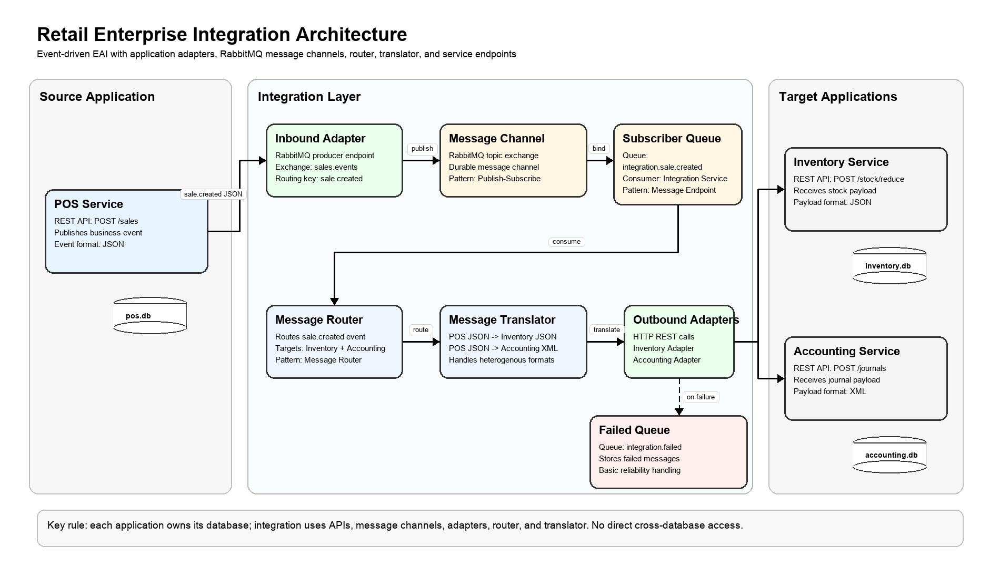

# Laporan Singkat Proyek Enterprise Application Integration

## Integrasi Sistem Retail Enterprise Menggunakan Microservices, RabbitMQ, dan Enterprise Integration Patterns

### 1. Pendahuluan

Pada banyak organisasi, aplikasi enterprise sering berkembang secara terpisah sesuai kebutuhan masing-masing unit bisnis. Kondisi ini menyebabkan munculnya information silos, yaitu keadaan ketika data penting tersimpan di beberapa sistem berbeda dan tidak mengalir secara otomatis antar aplikasi. Dalam konteks retail, sistem Point of Sales, Inventory, dan Accounting biasanya memiliki tanggung jawab yang berbeda, tetapi tetap saling membutuhkan data yang sama. Ketika transaksi penjualan terjadi di kasir, sistem stok perlu langsung mengetahui barang apa yang keluar, sementara sistem akuntansi perlu mencatat pendapatan dari transaksi tersebut.

Proyek ini dibuat untuk mensimulasikan integrasi enterprise sederhana pada domain retail. Sistem dibangun menggunakan arsitektur microservices, di mana setiap aplikasi berdiri sendiri, memiliki database masing-masing, dan tidak mengakses database aplikasi lain secara langsung. Integrasi antar aplikasi dilakukan melalui Integration Service dan RabbitMQ sebagai message broker.

Tujuan utama proyek ini adalah menunjukkan bagaimana satu business event dari POS Service dapat memicu perubahan otomatis pada Inventory Service dan Accounting Service. Dengan pendekatan ini, POS Service hanya bertanggung jawab membuat transaksi dan mengirim event, sedangkan proses pengurangan stok dan pencatatan jurnal dikerjakan oleh sistem lain melalui lapisan integrasi.

### 2. Tema dan Ruang Lingkup Sistem

Tema yang dipilih adalah Retail Enterprise Integration. Sistem ini terdiri dari tiga aplikasi utama dan satu layanan integrasi:

| Komponen | Peran |
|---|---|
| POS Service | Mencatat transaksi penjualan dan menerbitkan event `sale.created` |
| Inventory Service | Mengelola data produk, stok, dan riwayat pergerakan stok |
| Accounting Service | Mencatat jurnal transaksi penjualan |
| Integration Service | Membaca event dari RabbitMQ, melakukan routing, transformasi data, dan memanggil service tujuan |
| RabbitMQ | Message broker untuk mengirim event secara asinkron |

Setiap aplikasi utama memiliki database SQLite sendiri. Pemisahan database ini penting untuk menunjukkan bahwa masing-masing aplikasi dianggap sebagai sistem enterprise mandiri. POS Service tidak boleh mengubah stok langsung di database Inventory, dan tidak boleh membuat jurnal langsung di database Accounting. Semua komunikasi dilakukan melalui API dan integration layer.

Ruang lingkup fitur dibuat sederhana agar mudah dipahami dan didemokan, tetapi tetap memenuhi kebutuhan teknis tugas. Alur utama yang didukung adalah transaksi penjualan dari POS yang secara otomatis mengurangi stok Inventory dan membuat jurnal Accounting.

### 3. Arsitektur Sistem

Arsitektur sistem menggunakan model event-driven integration. POS Service bertindak sebagai event producer. RabbitMQ digunakan sebagai message channel untuk menyampaikan event. Integration Service bertindak sebagai consumer sekaligus penghubung ke sistem tujuan.

Alur arsitektur:



```text
Postman / Swagger UI
  -> POS Service
  -> RabbitMQ
  -> Integration Service
  -> Inventory Service
  -> Accounting Service
```

Saat user membuat transaksi melalui endpoint `POST /sales`, POS Service menyimpan transaksi ke database `pos.db`, lalu menerbitkan event `sale.created` ke RabbitMQ. Integration Service menerima event tersebut, membaca isi payload, lalu menentukan sistem tujuan. Untuk Inventory Service, Integration Service mengirim data dalam format JSON ke endpoint `POST /stock/reduce`. Untuk Accounting Service, Integration Service mengubah data transaksi menjadi XML dan mengirimkannya ke endpoint `POST /journals`.

Pemisahan peran ini membuat sistem menjadi loosely coupled. POS Service tidak perlu mengetahui detail cara Inventory mencatat stock movement atau cara Accounting membuat jurnal. POS hanya mengirim event bisnis, sedangkan Integration Service yang bertanggung jawab menghubungkan event tersebut ke aplikasi lain.

### 4. Desain Microservices

#### 4.1 POS Service

POS Service merupakan aplikasi kasir yang bertugas mencatat transaksi penjualan. Endpoint utama yang disediakan adalah:

| Endpoint | Method | Fungsi |
|---|---|---|
| `/health` | GET | Mengecek status service |
| `/sales` | POST | Membuat transaksi penjualan |
| `/sales` | GET | Melihat semua transaksi |
| `/sales/{id}` | GET | Melihat detail transaksi |

Data yang disimpan POS meliputi ID transaksi, nama pelanggan, metode pembayaran, total transaksi, status, waktu transaksi, dan daftar item. Setelah transaksi berhasil disimpan, POS Service membuat event `sale.created` dan mengirimkannya ke RabbitMQ.

#### 4.2 Inventory Service

Inventory Service bertanggung jawab mengelola produk dan stok. Service ini memiliki data awal produk seperti Keyboard, Mouse, dan Monitor. Endpoint utama yang disediakan adalah:

| Endpoint | Method | Fungsi |
|---|---|---|
| `/health` | GET | Mengecek status service |
| `/products` | GET | Melihat semua produk |
| `/products/{id}` | GET | Melihat detail produk |
| `/stock/reduce` | POST | Mengurangi stok berdasarkan transaksi |
| `/stock-movements` | GET | Melihat riwayat pergerakan stok |

Ketika menerima request pengurangan stok dari Integration Service, Inventory Service mengecek apakah produk tersedia dan stok mencukupi. Jika valid, stok dikurangi dan stock movement dicatat sebagai tipe `OUT`.

#### 4.3 Accounting Service

Accounting Service bertanggung jawab mencatat jurnal transaksi penjualan. Endpoint utama yang disediakan adalah:

| Endpoint | Method | Fungsi |
|---|---|---|
| `/health` | GET | Mengecek status service |
| `/journals` | POST | Membuat jurnal transaksi |
| `/journals` | GET | Melihat semua jurnal |
| `/journals/{id}` | GET | Melihat detail jurnal |

Accounting Service dapat menerima payload JSON maupun XML. Dalam alur integrasi utama, Integration Service mengirim payload XML agar sistem menunjukkan heterogenitas format data. Jurnal yang dibuat berisi reference ID transaksi, deskripsi, akun debit, akun kredit, jumlah, format sumber data, dan waktu pencatatan.

### 5. Mekanisme Integrasi

Mekanisme integrasi utama menggunakan RabbitMQ sebagai message broker. POS Service mengirim event ke exchange `sales.events` dengan routing key `sale.created`. Integration Service memiliki queue `integration.sale.created` yang terhubung ke exchange tersebut.

Alur integrasi end-to-end:

1. User membuat transaksi penjualan melalui POS Service.
2. POS Service menyimpan transaksi ke database sendiri.
3. POS Service menerbitkan event `sale.created` ke RabbitMQ.
4. Integration Service menerima event dari queue.
5. Integration Service melakukan routing ke Inventory dan Accounting.
6. Integration Service mengubah payload sesuai kebutuhan service tujuan.
7. Inventory Service mengurangi stok produk.
8. Accounting Service membuat jurnal transaksi.
9. User dapat mengecek hasil integrasi melalui endpoint Inventory dan Accounting.

Dengan mekanisme ini, komunikasi dari POS ke proses lanjutan bersifat asinkron. POS tidak harus menyimpan data langsung ke Inventory atau Accounting. RabbitMQ membantu memisahkan proses transaksi dari proses integrasi lanjutan.

### 6. Enterprise Integration Patterns yang Digunakan

Proyek ini menerapkan beberapa Enterprise Integration Patterns:

| Pattern | Implementasi |
|---|---|
| Message Channel | RabbitMQ digunakan sebagai kanal pesan antara POS dan Integration Service |
| Publish-Subscribe Channel | POS menerbitkan event ke exchange `sales.events` sehingga event dapat dikonsumsi oleh service lain |
| Message Router | Integration Service menentukan event `sale.created` harus dikirim ke Inventory dan Accounting |
| Message Translator | Integration Service mengubah payload POS menjadi format Inventory JSON dan Accounting XML |
| Message Endpoint / Adapter | Integration Service memanggil API Inventory dan Accounting melalui HTTP adapter |

Message Channel diterapkan melalui RabbitMQ queue. Publish-Subscribe diterapkan melalui exchange RabbitMQ, sehingga event dari POS dapat didistribusikan tanpa POS mengetahui consumer secara langsung. Message Router terlihat pada proses penentuan tujuan integrasi. Message Translator digunakan untuk mengubah struktur data antar sistem. Message Endpoint/Adapter digunakan ketika Integration Service melakukan pemanggilan HTTP API ke sistem tujuan.

### 7. Heterogenitas dan Transformasi Data

Salah satu kebutuhan tugas adalah adanya heterogenitas data. Proyek ini menerapkan perbedaan format data antara sistem sumber dan sistem tujuan.

POS Service mengirim event dalam format JSON:

```json
{
  "eventType": "sale.created",
  "source": "pos-service",
  "data": {
    "saleId": "SALE-001",
    "buyerName": "Budi",
    "paymentMethod": "cash",
    "totalAmount": 300000,
    "items": [
      {
        "productId": "P001",
        "name": "Keyboard",
        "quantity": 2,
        "price": 150000,
        "subtotal": 300000
      }
    ]
  }
}
```

Untuk Inventory Service, payload diterjemahkan menjadi JSON yang lebih sederhana:

```json
{
  "referenceId": "SALE-001",
  "items": [
    {
      "productId": "P001",
      "quantity": 2
    }
  ]
}
```

Untuk Accounting Service, payload diterjemahkan menjadi XML:

```xml
<journal>
  <referenceId>SALE-001</referenceId>
  <description>Sales transaction from POS for Budi</description>
  <debitAccount>Cash</debitAccount>
  <creditAccount>Sales Revenue</creditAccount>
  <amount>300000</amount>
</journal>
```

Transformasi ini menunjukkan bahwa sistem yang terintegrasi tidak harus memiliki struktur dan format data yang sama. Integration Service bertugas menjadi penerjemah antar sistem.

### 8. Containerization dan Konfigurasi

Setiap service memiliki Dockerfile masing-masing:

| Service | Dockerfile |
|---|---|
| POS Service | `pos-service/Dockerfile` |
| Inventory Service | `inventory-service/Dockerfile` |
| Accounting Service | `accounting-service/Dockerfile` |
| Integration Service | `integration-service/Dockerfile` |

Seluruh sistem dijalankan menggunakan `docker-compose.yml`. Komponen yang dijalankan adalah POS Service, Inventory Service, Accounting Service, Integration Service, dan RabbitMQ. RabbitMQ menggunakan image `rabbitmq:3-management` agar tersedia dashboard monitoring sederhana melalui port `15672`.

Konfigurasi penting disimpan di environment variable dan contoh konfigurasinya tersedia pada `.env.example`. Nilai seperti port, URL RabbitMQ, nama exchange, nama queue, path database, dan URL service tujuan tidak ditulis hardcode di kode utama. Pendekatan ini membuat sistem lebih fleksibel saat dijalankan di environment berbeda.

Persistensi data dilakukan dengan volume Docker. Database SQLite setiap service disimpan di direktori `/data`, sedangkan RabbitMQ menggunakan volume `rabbitmq_data`. Dengan begitu, data tidak langsung hilang ketika container direstart.

### 9. Dokumentasi API dan Pengujian

Setiap aplikasi utama memiliki dokumentasi Swagger/OpenAPI:

| Service | Swagger URL |
|---|---|
| POS Service | `http://localhost:3001/api-docs` |
| Inventory Service | `http://localhost:3002/api-docs` |
| Accounting Service | `http://localhost:3003/api-docs` |

Pengujian dapat dilakukan menggunakan Swagger UI atau Postman. Untuk demo cepat, request dapat dikirim menggunakan `curl`.

Skenario pengujian utama:

1. Cek stok awal produk `P001`.
2. Buat transaksi penjualan di POS dengan item `P001` sebanyak 2.
3. Cek stok `P001` di Inventory.
4. Cek stock movement di Inventory.
5. Cek jurnal di Accounting.
6. Cek status Integration Service.

Hasil yang diharapkan adalah stok `P001` berkurang, stock movement tercatat, dan jurnal Accounting otomatis dibuat berdasarkan transaksi POS.

### 10. Kendala dan Solusi

Beberapa kendala yang mungkin muncul dalam sistem integrasi ini:

| Kendala | Solusi |
|---|---|
| Service tujuan belum aktif saat Integration Service memproses event | Docker Compose mengatur dependency service dan RabbitMQ memiliki healthcheck |
| Format data antar sistem berbeda | Integration Service menerapkan Message Translator |
| Stok tidak cukup | Inventory Service mengembalikan error `409` agar transaksi integrasi tidak dianggap berhasil |
| Pesan gagal diproses | Integration Service mengirim pesan gagal ke queue `integration.failed` |
| Konfigurasi berubah antar environment | Endpoint, port, exchange, queue, dan database path disimpan di environment variable |

Untuk versi sederhana ini, mekanisme retry belum dibuat kompleks agar project tetap mudah dipahami. Namun Integration Service sudah memiliki failed queue sebagai bentuk dasar penanganan pesan yang gagal.

### 11. Kesimpulan

Proyek ini berhasil mensimulasikan integrasi enterprise pada sistem retail dengan tiga aplikasi utama: POS, Inventory, dan Accounting. Setiap aplikasi berdiri sebagai microservice, memiliki database sendiri, dan berkomunikasi melalui API serta lapisan integrasi.

Satu transaksi penjualan dari POS dapat memicu event `sale.created`, lalu Integration Service memproses event tersebut untuk mengurangi stok Inventory dan membuat jurnal Accounting. Proyek ini juga menerapkan beberapa Enterprise Integration Patterns seperti Message Channel, Publish-Subscribe Channel, Message Router, Message Translator, dan Message Endpoint/Adapter.

Dengan adanya Docker Compose, Swagger/OpenAPI, dokumentasi skema pesan, dan demo end-to-end, sistem ini memenuhi kebutuhan utama tugas Enterprise Application Integration. Implementasi dibuat sederhana agar mudah dijalankan dan dipresentasikan, tetapi tetap mencakup aspek penting seperti microservices, heterogenitas data, containerization, konfigurasi environment, persistensi data, dan integrasi end-to-end.
